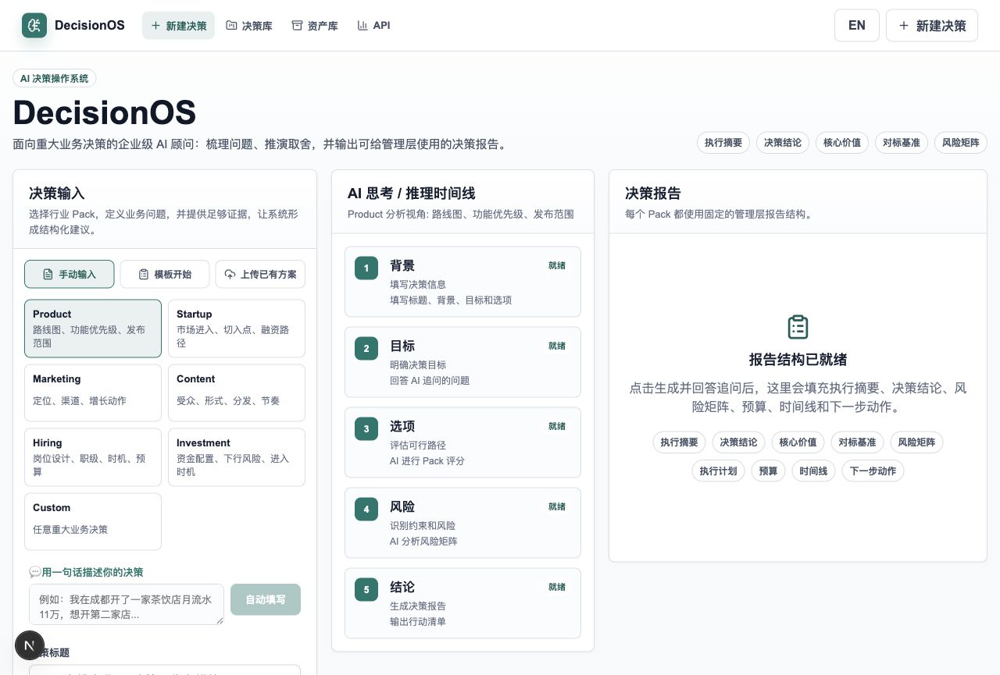

# DecisionOS

**AI Decision Operating System** — 面向重大业务决策的企业级 AI 顾问系统。

DecisionOS 不是 AI 生成器，而是在做产品、创业、营销、内容、招聘、投资等关键决策前，用结构化输入、Pack 评分、追问、案例对标和行动清单，帮助团队形成可执行的决策报告。



## 当前开源版包含什么

| 模块 | 开源版能力 |
|---|---|
| 决策输入 | 支持手动输入、模板开始、上传已有方案入口 |
| 行业 Pack | Product、Startup、Marketing、Content、Hiring、Investment、Custom |
| AI 追问 | Generate 后先按 Pack 追问 3-5 个问题，再生成报告 |
| Pack 评分 | Product 使用 RICE；Startup、Marketing、Hiring、Investment 使用独立权重模型 |
| 推理时间线 | 展示信息提取、评分模型、维度打分、案例对标、加权计算、结论 |
| 决策报告 | 固定输出执行摘要、决策结论、核心价值、对标、风险矩阵、执行计划、预算、时间线、下一步动作 |
| 参考案例 | 后端内置 3 个开源演示案例，用于相似案例匹配 |
| 本周行动清单 | 报告末尾生成可勾选行动项，支持一键复制 |
| 用户反驳 | 报告底部可输入异议，系统局部更新结论和受影响模块 |
| 导出 | 支持 PDF、Markdown、复制报告全文 |
| 决策库 | `/projects` 提供可点击套用的决策模板 |
| 决策资产库 | `/assets` 查看历史决策资产，并支持 7/30/90 天复盘记录 |
| 中英文 | 默认中文，可切换英文 |

## 企业版边界

开源仓库保留企业能力开关，但企业实现默认关闭且不包含私有实现。

| 企业能力 | 开源仓库状态 |
|---|---|
| LLM 增强评分 | `llm_scoring=false` |
| 自定义 Pack | `custom_packs=false` |
| 私人案例库 | `private_cases=false` |
| 团队 SSO | `team_sso=false` |
| 企业集成 | `enterprise_integrations=false` |
| PDF 增强排版 | `enhanced_pdf=false` |
| 五源决策依据引擎 | `five_source_engine=false` |

以下企业版私有文件已被 `.gitignore` 排除，不进入公开仓库：

```text
backend/enterprise/decision_parser.py
backend/enterprise/enhanced_scoring.py
backend/enterprise/five_source_engine.py
backend/enterprise/llm_scoring.py
backend/data/decision_assets.json
```

## 快速启动

### 后端

```bash
cd backend
pip install -r requirements.txt
uvicorn main:app --host 127.0.0.1 --port 8001
```

### 前端

```bash
cd frontend
pnpm install
pnpm dev --hostname 127.0.0.1 --port 3000
```

打开：

```text
http://127.0.0.1:3000
```

## 主要页面

| 路由 | 说明 |
|---|---|
| `/` | 新建决策、Pack 选择、追问、报告生成、导出、反驳 |
| `/projects` | 决策库模板，可点击套用到首页表单 |
| `/assets` | 决策资产库与复盘记录 |

## API

| 接口 | 说明 |
|---|---|
| `GET /api/decision/features` | 查看开源版与企业能力开关 |
| `POST /api/decision/generate-followups` | 根据 Pack 和表单生成追问 |
| `POST /api/decision/submit-answers` | 合并原始输入与追问答案 |
| `POST /api/decision/generate` | 生成决策报告 |
| `POST /api/decision/feedback` | 对报告结论提出异议并局部更新 |
| `GET /api/decision/{id}/export?format=pdf` | 导出 PDF |
| `GET /api/decision/{id}/export?format=markdown` | 导出 Markdown |
| `GET /api/decision/assets` | 获取决策资产库 |

## 技术栈

| 层 | 技术 |
|---|---|
| 前端 | Next.js 16 + React 19 + TypeScript |
| 后端 | Python FastAPI |
| 文档导出 | ReportLab / Markdown |
| 样式 | CSS Modules-style global stylesheet |
| 图标 | lucide-react |

## 开源协议

AGPL v3。你可以自由使用、修改和分发本项目；如果你分发修改版本，需要按 AGPL v3 提供对应源码。

企业版能力、私有案例库、五源决策依据引擎和 LLM 增强评分不包含在公开仓库中。
